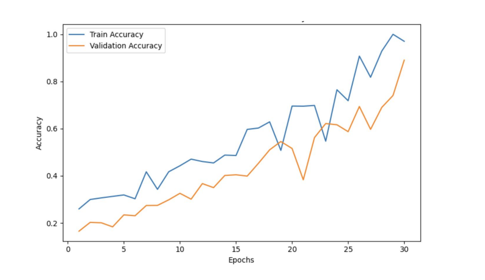
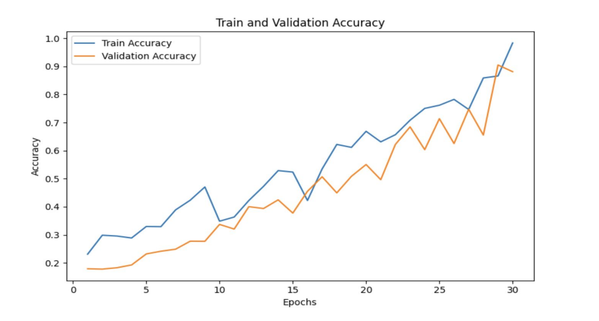
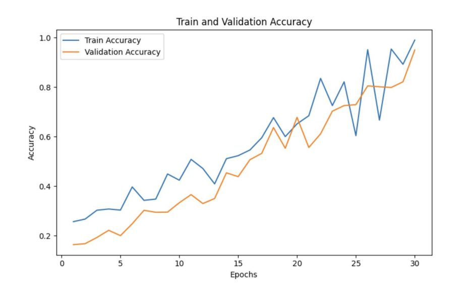

# Brain Tumor Classification

## Abstract
A brain tumor is a dangerous malignant tumor that is extremely frequent and can shorten a
person's life if it is not detected in its early stages. After the tumor is discovered, classifying the
tumor is a crucial first step toward developing a successful treatment strategy. Using
Convolutional Neural Network (CNN) model architectures, this study intends to improve the
level and efficiency of MRI scanners in recognizing the types and classification of tumors by
utilizing transfer learning with well-known architectures such as VGG16 and ResNet18. The
project made use of a dataset of MRI scans containing different types of scans, categorized into
distinct classes into meningioma, glioma, no tumor, and pituitary tumor. Results show how
transfer learning can enhance model performance, which promises well for these models'
practical use in medical image processing.

## Introduction
There is a very significant group of people who have been diagnosed with a brain tumor. In 2020,
there were an estimated 180,047 people living with brain and other nervous system cancer in the
United States alone (Cancer Stat Facts: Brain and Other Nervous System Cancer, 2023). The
central nervous system of the brain, which is the most complicated structure, controls higher
neural activities such as memory, intelligence, and consciousness in humans. Whether the tumor
is benign or malignant, once it has spread to any part of the brain, it will damage the various
functions of the human body. Furthermore, brain tissue is more complex than any other part of
the body, complicating treatment and diagnosis. Traditionally, in addition to analyzing a patient's
symptoms, doctors typically require physiological test results as well as a series of images
generated by MRI. Early detection and classification of brain tumors become critical tasks in
case assessment, helping in the selection of the most convenient treatment method to save
patients' lives. Furthermore, in some complicated cases, the classification stage may be a
confusing and time-consuming task for physicians or radiologists. These cases require experts to
work on them to localize the tumor, compare tumor tissues with adjacent regions, apply
filters to the image if necessary to make it more clear for human vision, and finally determine
whether it is a tumor, as well as its type and grade if available. This task takes time, which is why
a Computer Aided Diagnosis (CAD) system is needed to detect brain tumors in much less time
without human intervention. Since the rapid development of deep learning, many new
technologies for medical image analysis, such as convolutional neural networks, 3-dimensional
convolutional neural networks, and neural computing, have emerged (H. H. Sultan, 2019).
This work sought to assess the effectiveness of deep learning in the classification of brain
tumors. However, current multiclass classification models for brain tumors are constrained by a
lack of data, which has a negative impact on the performance of deep learning-based models (S.
Mascarenhas, 2021). To address this issue, we propose using a model trained on a larger dataset
and applying transfer learning to analyze the relatively small brain tumor dataset. We can ensure
the effectiveness of transfer learning for image feature extraction by initializing the learning
weights and biases from the ImageNet dataset model. Consequently, a two-fold approach was
adopted in this project, first, utilizing traditional CNN architectures for baseline models, and
second, employing transfer learning with pre-trained models (VGG16 and ResNet50) to leverage
features learned from the ImageNet dataset model. This hybrid approach addresses the
challenges of limited labeled medical data. Learning hierarchical features are crucial for capturing
intricate patterns and structures. CNN, VGG16, and ResNet50 excel in learning hierarchical
features from medical images over other models and hence they were chosen for this work (S.
Mascarenhas, 2021). The dataset used for this project is the IEEE Brian Tumor MRI Dataset.
This study is organized as follows; in the next section background of the related works is
discussed. After that the approach containing the model architectures is described. In the
penultimate section, results are stated and discussed in detail. The study ends with a conclusion
derived from the results.

## Background
Ertosun & Rubin (2015) used CNN to classify different grades of glioma pathological images
(Grade II, Grade III, and Grade IV), as well as another task to classify Low-Grade Glioma
(LGG) vs. High-Grade Glioma (HGG). They achieved 71% and 96% accuracy, respectively. In
another work, they trained and developed two main approaches for classification (fully
connected neural network and a convolutional neural network), CNN architecture was formed of
two convolutional layers with two corresponding max-pooling layers followed by two fully
connected layers and achieved maximum accuracy of 91.43% (Paul, Plassard, Landman, &
Fabbri, 2017). Afshar, Plataniotis, & Mohammadi (2019) presented a capsule network (CapsNet)
for classifying brain tumors that integrates both the MRI brain image and the coarse tumor
boundaries. This study achieved an accuracy of 90.89%. In another study, Anaraki, Ayati, &
Kazemi (2019) proposed a model of two combined regulations to classify brain tumor images
based on CNN and Genetic Algorithms (GA-CNN). In the first case study, accuracy of 90.9%
was achieved in classifying three grades of glioma, while accuracy of 94.2% was achieved in the
second case study for classification of glioma, meningioma, and pituitary tumor. Using a
modified version of AlexNet CNN, Khawaldeh, Pervaiz, & Alkhawaldeh (2017) proposed a
system for non-invasive classification of glioma brain tumors. The classification was done using
MRI images of the entire brain, and the labels were at the image level, not the pixel level. The
system was evaluated and found to be 91.15% accurate. Sajjad, et al.(2019) proposed using CNN
as a data augmentation method for brain tumor classification. The method used to classify brain
tumors using segmented brain tumor MRI images. For classification, they used a pre-trained
VGG-19 CNN architecture and achieved accuracies of 87.39% and 90.66% for data before and
after augmentation, respectively.

## Approach
The methods that we have employed in our project are Convolutional Neural Networks (CNN),
VGG16 model, and ResNet model.

### CNN:
CNN, or Convolutional Neural Network, is a type of artificial neural network (ANN) that is
mostly used for analyzing visual data such as images and videos. It is especially designed to
recognize patterns within input data by using convolutional layers, pooling layers, and fully
connected layers. The main advantages of CNNs over traditional machine learning and vanilla
neural networks are feature learning and unlimited accuracy, which can be achieved by
increasing training samples and thus leads to a more robust and accurate model (Litjens, et al.,
2017). Convolutional filters act as feature extractors in CNN architecture, and as we go deeper,
we extract more and more complex features (spatial and structural information). Convolving
small filters with the input patterns produces feature extraction, which is followed by the
selection of the most distinguishing features and the start of training the classification network
(LeCun, Bengio, & Hinton, 2015).

### VGG16:
Convolutional neural network (CNN) architecture VGG16 is renowned for its efficiency and
simplicity in image recognition applications. It was created in 2014 as a part of the ImageNet
Large Scale Visual Recognition Challenge (ILSVRC) by the University of Oxford's Visual
Graphics Group (VGG).
VGG16's depth, which is comprised of 16 layers—13 convolutional layers and 3 fully connected
layers—is one of its most important features. The convolutional layers of the uniform design
primarily use 3x3 filters with a stride of 1. Down-sampling between convolutional layers is done
using max-pooling layers with 2x2 filters and a stride of 2 (Albashish, Al-Sayyed, Abdullah,
Ryalat, & Almansour, 2021).

### ResNet:
Microsoft Research unveiled ResNet, or Residual Neural Network, a revolutionary deep learning
architecture in 2015. By introducing residual connections, it solved the difficulty of training very
deep networks and revolutionized deep neural networks.
The introduction of residual blocks with skip connections—also referred to as identity mappings
or shortcut connections—into ResNet is the main innovation. Bypassing specific layers, the
network can transfer data directly from earlier layers to deeper layers thanks to these links. Even
null transformations can be avoided by learning residual mappings, which lessens the vanishing
gradient issue that arises when training really deep networks (Reddy & Juliet, 2019).

## Results
The dataset used has 7023 MRI scans classified into 4 classes namely, meningioma, glioma,
pituitary tumor, and no tumor. The performance metric we used for this classification problem is
accuracy. The following are the different accuracies we achieved for models we used:

1. **CNN Model:**
   For the CNN model we achieved 97.5% of training accuracy and validation accuracy of
   89.8%. The following plot shows the accuracy over epochs.

   

2. **VGG-16 Model:**
   For the VGG-16 model we achieved 97.5% of training accuracy and validation accuracy
   of 91.1%. The following plot shows the accuracy over epochs.

   

3. **ResNet-18 Model:**
   For the VGG-16 model we achieved 98.5% of training accuracy and validation accuracy
   of 95.1%. The following plot shows the accuracy over epochs.

   

## Conclusion
In summary, the results from our comparative examination of the CNN, VGG16, and ResNet
models show that the ResNet model performs better than the other models with an amazing
accuracy of 95.1%. This outcome demonstrates how well ResNet handles the dataset's
complicated features and hierarchical representations. Although CNN and VGG16 performed
admirably, they were not as accurate as ResNet, which suggests that residual learning is useful
for improving model depth and reducing the vanishing gradient issue.
The project's conclusions offer insightful information about how these designs perform in
comparison, providing the basis for choosing the best model for a particular task. Deep learning
techniques may continue to progress as a result of chances to improve these architectures'
performance through additional study and investigation into model optimization and fine-tuning.
